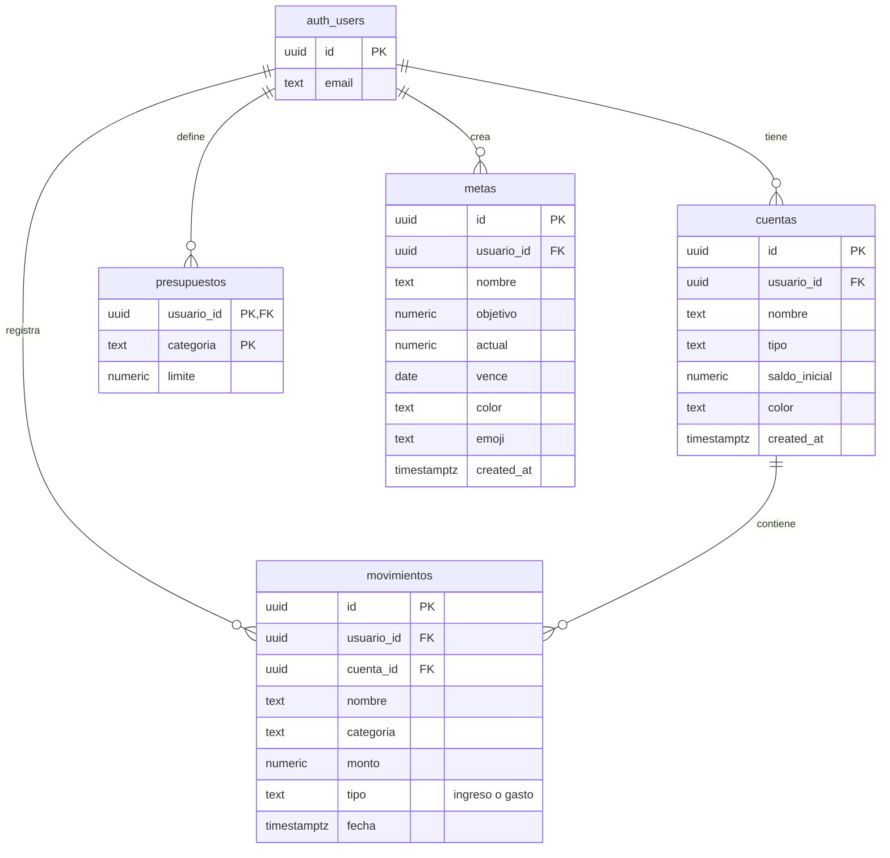

# Estructura de datos de FinSight

- `auth.users` la crea Supabase Auth. El correo y la contraseña no se guardan en las tablas de la app.
- Una cuenta tiene muchos movimientos. El saldo mostrado es `saldo_inicial + ingresos - gastos` de esa cuenta.
- El presupuesto guarda el límite de cada categoría. Lo gastado se calcula con los movimientos del mes actual, así que los límites se reutilizan cada mes.
- Las categorías y sus iconos son opciones de la interfaz, no otra tabla.
- Cada tabla tiene `usuario_id`. Las políticas RLS permiten leer y cambiar solo las filas del usuario autenticado. La clave foránea compuesta de `movimientos` exige que la cuenta pertenezca al mismo usuario.

El SQL que crea esta estructura está en [schema.sql](schema.sql).
